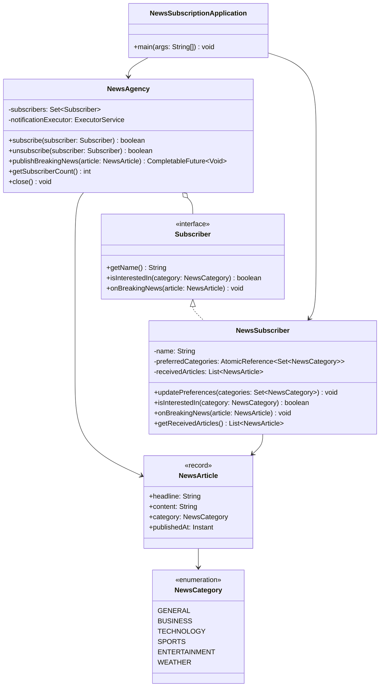

# UML Class Diagram

```mermaid
classDiagram
    class Subscriber {
        <<interface>>
        +getName() String
        +isInterestedIn(category: NewsCategory) boolean
        +onBreakingNews(article: NewsArticle) void
    }
    class NewsAgency {
        -subscribers: Set~Subscriber~
        -notificationExecutor: ExecutorService
        +subscribe(subscriber: Subscriber) boolean
        +unsubscribe(subscriber: Subscriber) boolean
        +publishBreakingNews(article: NewsArticle) CompletableFuture~Void~
        +getSubscriberCount() int
        +close() void
    }
    class NewsSubscriber {
        -name: String
        -preferredCategories: AtomicReference~Set~NewsCategory~~
        -receivedArticles: List~NewsArticle~
        +updatePreferences(categories: Set~NewsCategory~) void
        +isInterestedIn(category: NewsCategory) boolean
        +onBreakingNews(article: NewsArticle) void
        +getReceivedArticles() List~NewsArticle~
    }
    class NewsArticle {
        <<record>>
        +headline: String
        +content: String
        +category: NewsCategory
        +publishedAt: Instant
    }
    class NewsCategory {
        <<enumeration>>
        GENERAL
        BUSINESS
        TECHNOLOGY
        SPORTS
        ENTERTAINMENT
        WEATHER
    }
    class NewsSubscriptionApplication {
        +main(args: String[]) void
    }

    Subscriber <|.. NewsSubscriber
    NewsAgency o-- Subscriber
    NewsAgency --> NewsArticle
    NewsSubscriber --> NewsArticle
    NewsArticle --> NewsCategory
    NewsSubscriptionApplication --> NewsAgency
    NewsSubscriptionApplication --> NewsSubscriber
```

